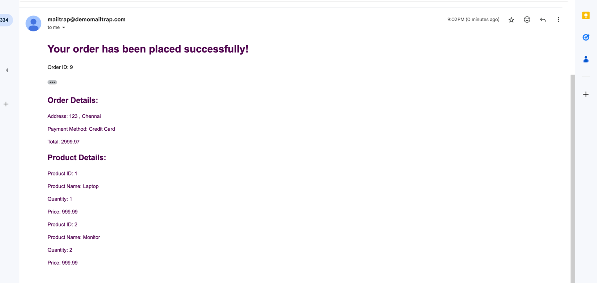

# Ecommerce-Platform

## Installation
https://mailtrap.io/ - For testing email notifications

### Prerequisites
- Java 11
- Maven
- IntelliJ IDEA (or any preferred IDE)

### Steps
1. Clone the repository: `git clone https://github.com/ramananrpn/Ecommerce-Platform.git`
2. Navigate to the project directory: `cd Ecommerce-Platform`
3. Build the project: `mvn clean install`

## Usage
Provide instructions on how to use your application. Include any necessary commands to run and test the application.

## Features
- User Registration and Authentication
- Product Listing
- Order Management
- Inventory Management
- Notification Service

## Generating Secrets
### Here are the steps to generate the Client ID, Client Secret, and JWT Secret for the application.

Using Command Line (Linux/macOS):
```bash
# Generate Client ID (24 bytes)
CLIENT_ID=$(openssl rand -base64 18 | tr -d /=+ | cut -c -24)
echo "Client ID: $CLIENT_ID"

# Generate Client Secret (48 bytes)
CLIENT_SECRET=$(openssl rand -base64 36 | tr -d /=+ | cut -c -48)
echo "Client Secret: $CLIENT_SECRET"

# Generate JWT Secret (64 bytes)
JWT_SECRET=$(openssl rand -base64 48 | tr -d /=+ | cut -c -64)
echo "JWT Secret: $JWT_SECRET"
```

Add values to application.properties file:
```properties sample
spring.security.client.id=eyJhbGciOiJIUzI1NiIsInR5cCI6IkpXVCJ9
spring.security.client.secret=Zm9vYmFyMjM1Pz8pX19lbmNyeXB0
spring.security.jwt.secret=aGVsbG9zdGFrZXRoZXNlY3JldGZvcnlvdXJhcHBsaWNhdGlvbg# BankingService
```

For email configuration, add the following properties to the application.properties file:
```properties sample
spring.mail.host=smtp.gmail.com
spring.mail.port=587
spring.mail.username=ramananrpn@gmail.com
spring.mail.password=xxxxxxx
spring.mail.properties.mail.smtp.auth=true
spring.mail.properties.mail.smtp.starttls.enable=true
 ```

## Docker
### Running the Docker Containers
run docker-compose up

## Sample Email Notification



